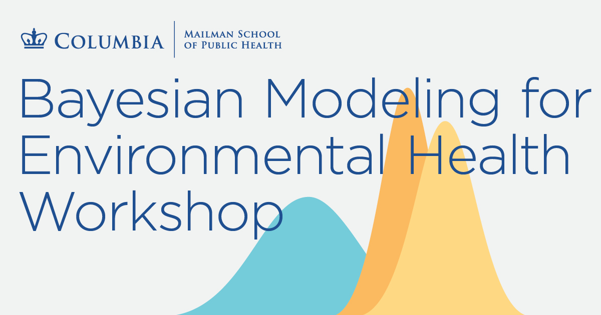

# SHARP: Bayesian Modeling for Environmental Health Workshop

## Introduction

GitHub project through which we're developing and sharing materials for the SHARP Bayesian Modeling for Environmental Health Workshop.

## Notes for those working on the repo

### Using `pre-commit`

Run `pre-commit install` to install the hooks.
You now won't be able to commit until you pass the hooks.
These (among other things) automatically format files and prevent us from committing ugly code.
For more details, see the main [docs](https://pre-commit.com/) and the `R` [docs](https://lorenzwalthert.github.io/precommit/).

### Using `renv`

`renv` maintains consistency between users' `R` environments.
Run `renv::restore()` and the environment will be downloaded into the repository based on the `renv.lock` file.
If you want to add a packages to the lockfile, install the package and then run `renv::snapshot()`.
For more details, see the [docs](https://rstudio.github.io/renv/articles/renv.html).
